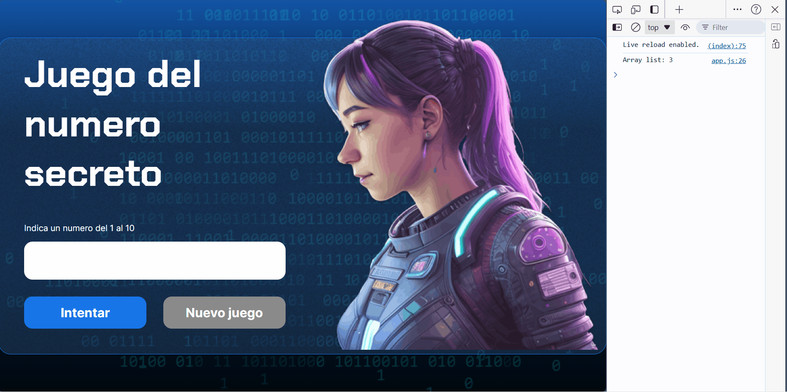

# Juego Secreto

## Descripcion

En **Juego Secreto**, al inicar habra un numero aleatorio, el cual debe ser descubierto por el jugador, este proyecto es del parte del curso de **Alura Latam** para el curso de **Lógica de programación: explorar funciones y listas**.

## Description

In **Juego Secreto**, at the start there will be a random number that the player must discover. This project is part of the **Alura Latam** course for the **Programming Logic: Exploring Functions and Lists** course.

---

> 
